## Comparing JProfiler with FusionReactor – the battle of best profilers
In our previous blog posts we tried to compare FusionReactor with open source java profiling tools such as GUI based Java VisualVM, and terminal applications such as `jcmd` and `jstack`. We concluded that for production level profiling the FusionReactor is a undoubt winner. However, in the Java world, another profiler got a dominant market place. It is called `JPofiler` and it was developed by people behind **ej-technologies**. The `JPofiler` advertises itself as 
>The Award-Winning All-in-One Java Profiler
And indeed this Profiler is no doubt can give deep insides of a running production level application with minimum overhead. The main webpage of **JProfiler** shows the of features that makes it **the best profiling tool**. Today we are going to go through each use case and compare how it can be accomplished by **FusionReactor**

## Under the Hood
First of all, both tools use the same JVM API to collect statistics of a running Java process called **java agent**. We talked more about Java agents in our blog that covers [**Java VisualVM**](https://www.fusion-reactor.com/blog/java-visualvm-alternatives/).
## Launching 
The first difference between the tools come from the way they are attached to Java proccess. **JProfiler** is a desktop tool written in Swing and in order to use it you first have to install the app. The [download](https://www.ej-technologies.com/download/jprofiler/files) page gives you downloadable app for many supported operating systems with pre-installed JRE. After you installed and launched the profiler you will have to attach it to the Java process running on local machine , remote server or inside of a container.
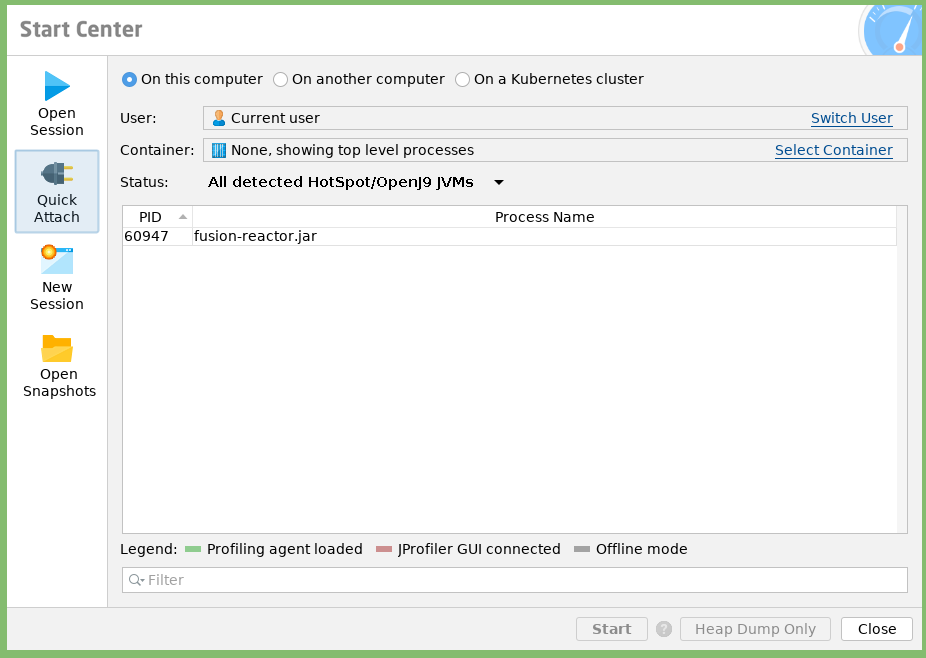
In our case we chose a local java process. After that you will have to choose a recording method. **JProfiler** supports sampling and instrumentation. You can read the in-depth description [here](https://www.ej-technologies.com/resources/jprofiler/v/13.0/help/doc/main/methodCallRecording.html?light) but in essence with the choosing sampling **JProfiler** will periodically record the stracktraces of each thread while instrumentation will modify the bytecode of application classes to trace methods entries and exits
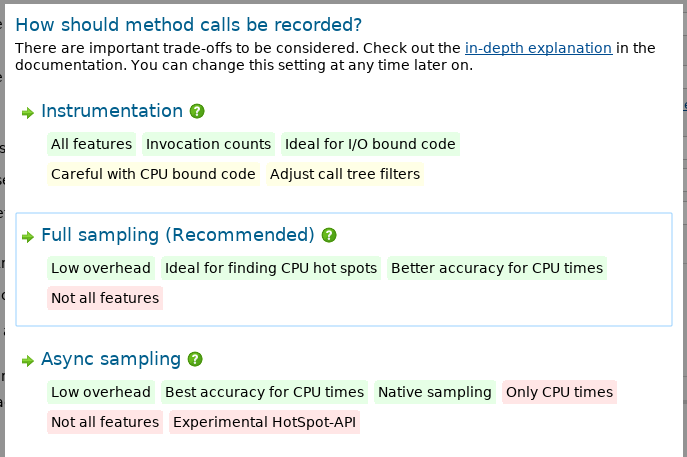

For fair comparison we will go with Instrumentation. Finally you can start profiling your app.

Here is the few disadvantages with this process
1. First of all ,you have to install the executable with **JProfiler**. With consequent updates, the app must be reinstalled again.
2. Secondly, the range of supported environments is huge but requires a lot of effords for production environment. By profiling the process in the remote host you need toenable and configure ssh agent in the production machine which requires some development experience.

How FusionReactor is different ? 
First of all, **FusionReactor** is a web app. You don't have to install anything in your computer which makes non IT folks lives easier. The second biggest difference with **JProfiler** is that the former one can only be attached to the single Java process on startup. It doesn't matter where you host your Java application whether it's a dedicated server, container or even locally. With FusionReactor your production level application is constantly monitored with a low overhead.


## Exceptional ease of use
The first selling point that JProfiler uses on their website is **Exceptional ease of use**. We won't doubt it. The interface is tidy and clean. All buttons are intuitive and anyone who is familiar with JVM architecture can easily familiaris themself with the tool and all the metrics it tracks. 

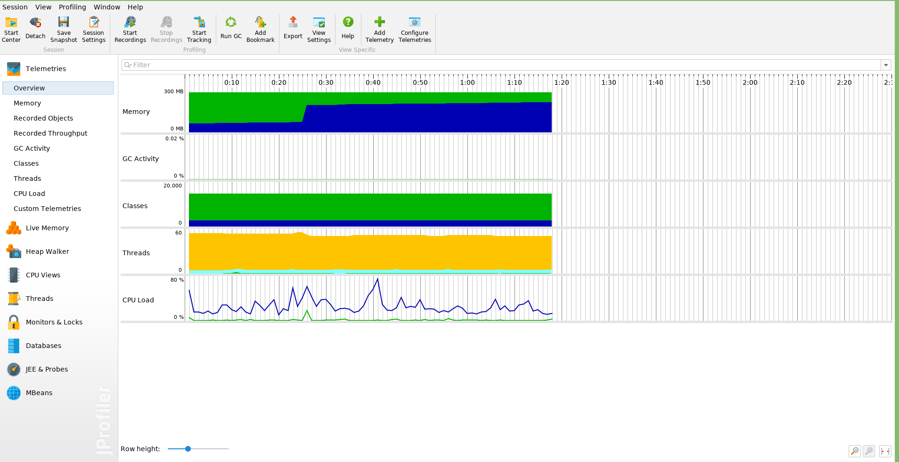

JProfiler has few main tabs that helps you to track your application. Let's compare each of them with what FusionReactor can offer.
### Telemetries
Shows top level information about your app(total memory , GC activity, loaded classes , Threads and CPU load)
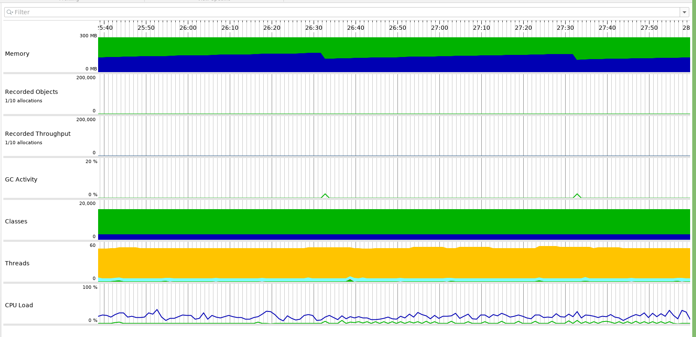

The analog to Telemetries in FusionReactor is **Metrics** tab that also covers web based metrics. Live memory - real time memory allocated by each object in the heap
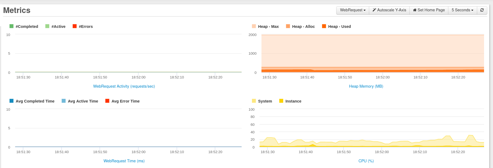
And here is how  web metrics page looks like
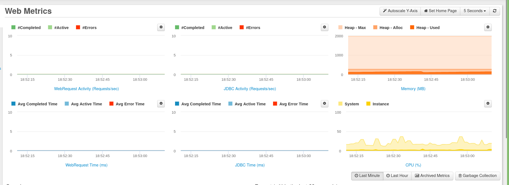

No such information is included in JProfiler's Telemetries
### Live memory
Shows you all the allocated objects in the real time
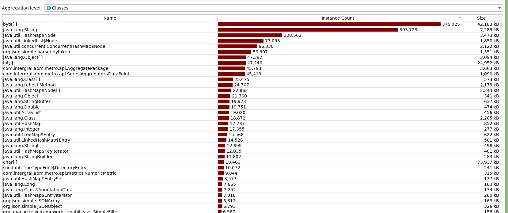

Same information can be obtained in FusionReactor under the **Memory** tab
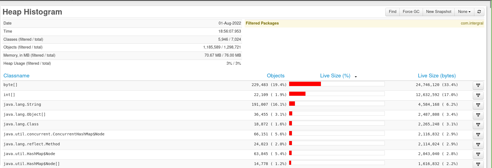

### Threads
List all of the application threads with their states
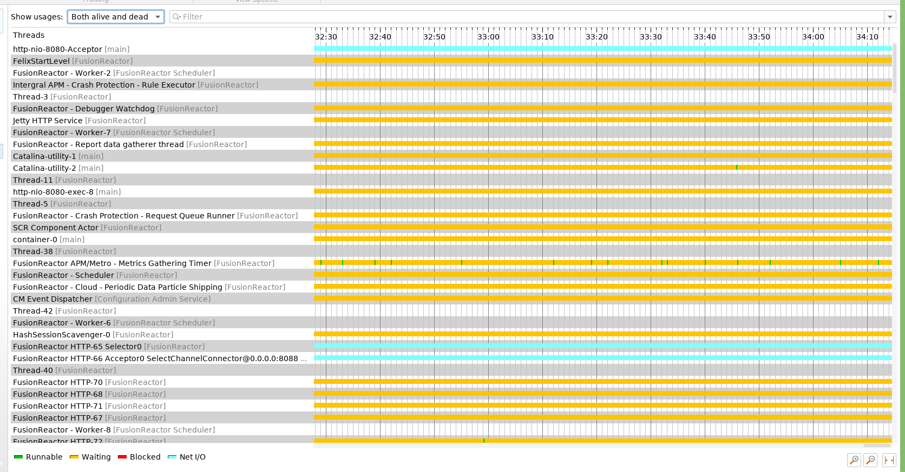

In FusionReactor, under the **Resources** tab you can see the same list of threads. 
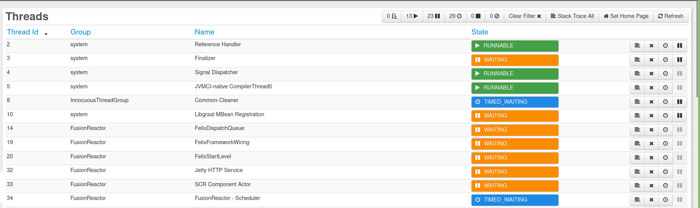

Moreover, each thread is clickable which redirects you to the page with pretty printed stack traces of corresponding thread
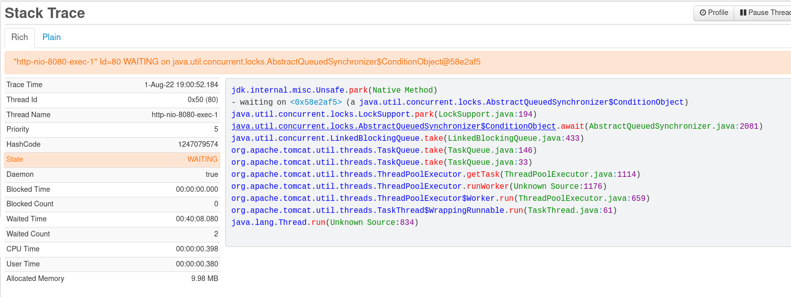

### CPU view 
Amount of CPU cycles taken by each method
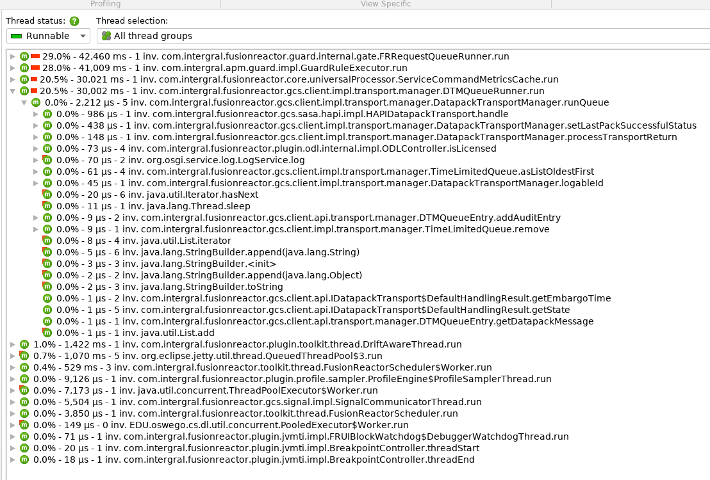

In FusionReactor, using the Transactions tab you can see the CPU usage on per Thread basics, by clicking on the thread you will see the page similar to JProfiler
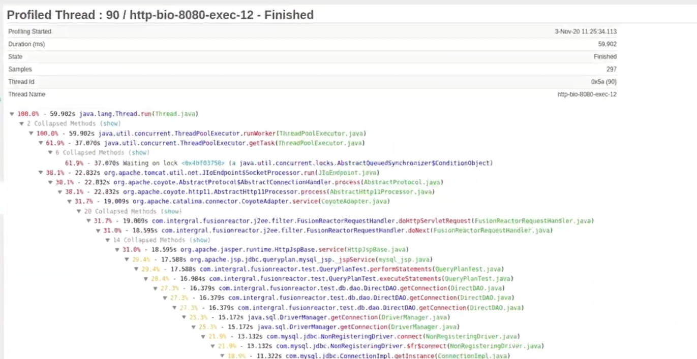
### Databases 
All JDBC calls made by your app(other non JDBC based protocols are supported too for example Cassandra and HBase)
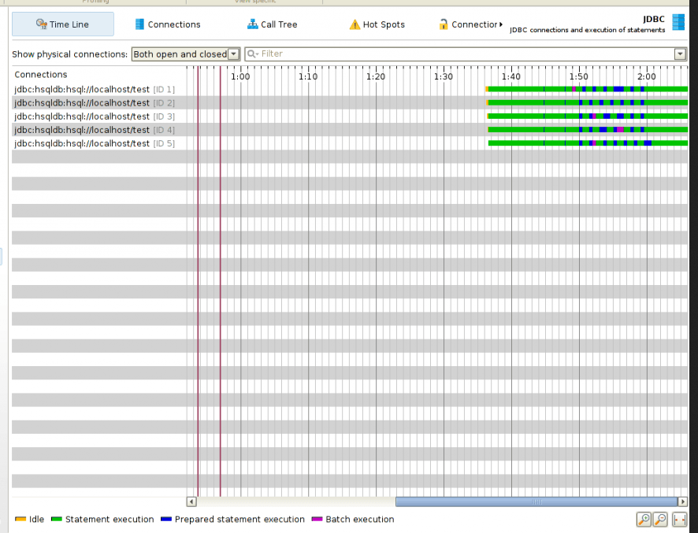

The JDBC tan in FusionReactor shows you the history of all JDBC queries whether it was a plain JDBC or higher level JPA framework

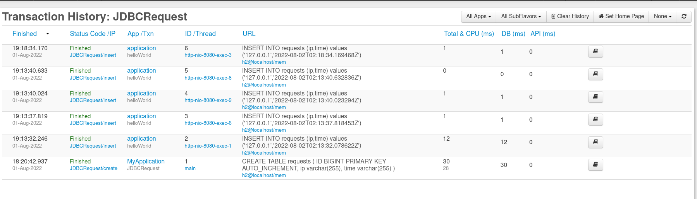

FusionReactor however only support databases with corresponding JDBC driver implementation(which most of the relational databases do)

### JEE probes
Web based metrics. It covers the metrics from HTTP server, amount of exceptions and information about the sockets
We believe that **Requests** tab in FusionReactor is more powerful and offers vider variety of metrics and ways to detect the performancer issue. First of all, all requests history are persisted 
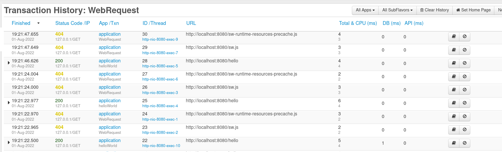

Requests can be sorted by longest requests and by those which took bigger amount of memory. You can click on the detail icon next to each request to see the detailed metrics 
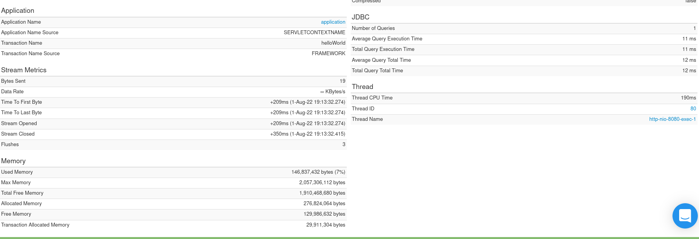

For example here is the page that shows how much memory it took and amount of JDBC calls it made.

## Zero-configuration remote profiling
Another thing that JProfiler can offer you is a zero-configuration profiling of remote java processes. You must however need to configure ssh tunnel. The same can be applied to FusionReactor as well. FusionReactor's main target is a production observability. When you start your app with FusionReactor's agent attached to it, it exposes the port on the same host machine that is running the admin panel. Remote profiling for FusionReactor is just a matter of opening this port for a remote access.

## Built-in support for Docker and Kubernetes
JProfiler has a build in support for containerized environments such as Kubernetes. It's just a matter of choosing the Pod from the main page and JProfiler will give you a list of all java processes. 
With FusionReactor it's almost that easy. First you don't need to create a Kubernetes service to access admin panel. All you need to do is to forward ports. Assuming you have `kubectl` you can use the following command.
```
kubectl get pods -n <namespace> # get all the pods
kubectl port-forward -n <namespace> <pod_name> 8088:8088 # enable port forwarding
```
Now you can open the browser and reach out this url `http://localhost:8088/`

## Excellent support for Java Enterprise Frameworks
JProfiler supports the most popular Java frameworks such database access such as JPA/Hibernate and web frameworks such as Spring and JavaEE. Same is true for FusionReactor. Both tools are capable of showing the lifetime of the HTTP Request in Servlet Container and sql queries made from JPA.

## Integration with application servers and IDEA
JProfiler is able to monitor java application that run of top of the application servers such as Tomcat or any other Servlet Containers. FusionReactor offers the same capabilities.
For example in terms of a Tomcat, FusionReactor needs to be added in the `setenv.sh` script before you launch the Tomcat
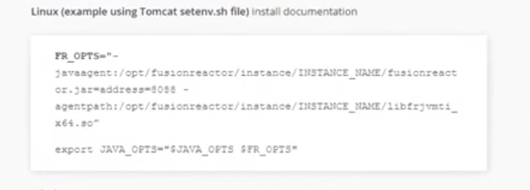

## What FusionReactor supports that JProfiler doesn't
### Remote Debugging
You can attach the debugger to the running process without killing the performance of the underlying application with FusionReactor. By default only single Thread will wait on the breakpoint which won't disturb your customers from using the app. You can also tell FusionReactor how long the breakpoint can wait till resuming the execution
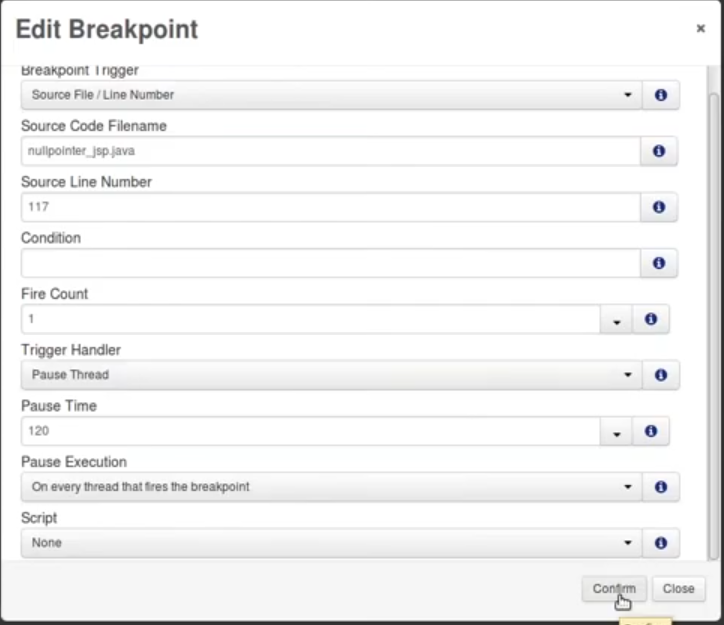

### Notifications
With FusionReactor your application is constantly monitored without you being involved. If something happens with your application , you will get an email with the root cause. Later on you can check yourself whether it's something critical or not

### Persistance
The main problem with JProfiler is that you have to manually start recording the data.For example, when you open Exceptions tab you won't see anything unless you press the **recording** button

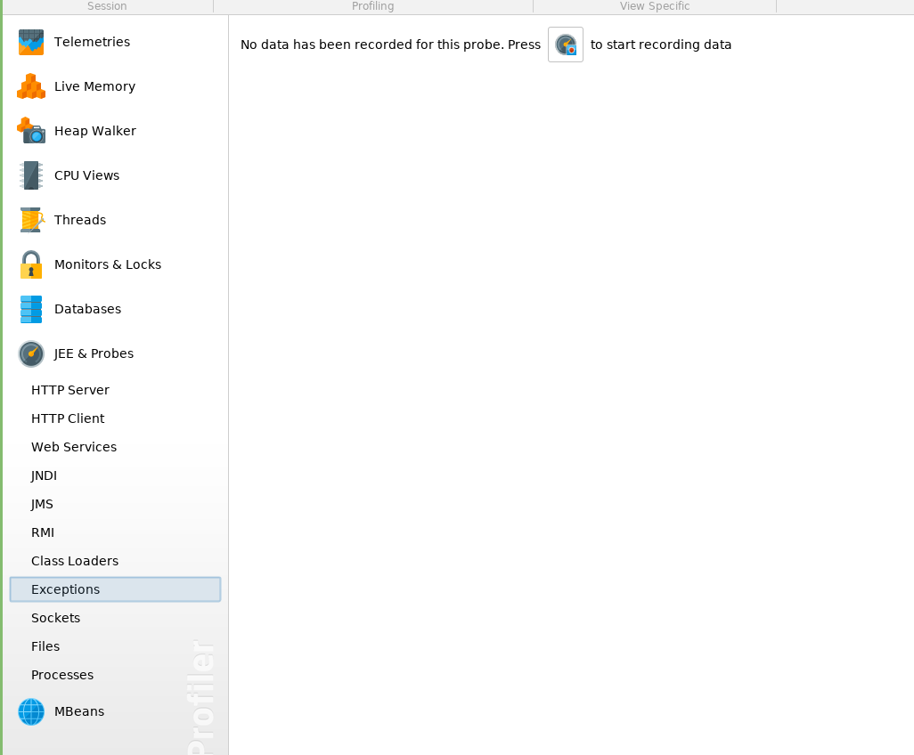

It means that the errors that happened before recording are missed. FusionReactor eliminate this problem by constantly monitoring your app.
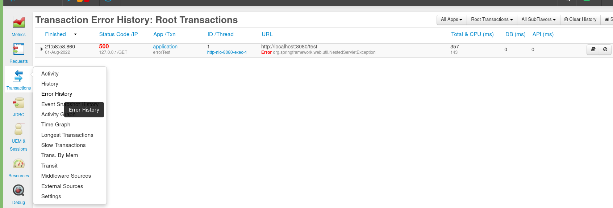

All the exceptions can be seen in Error History tab. Once you found an appropriate exception you can click on Event Snapshot to take a look at the root cause with the information attached(http params of the request, JDBC queries etc). You can also attach the debugger the the root cause right away by pressing the Debug button

### System Metrics
Apart from the Java process you might be interested how underlying server is doing. FusionReactor shows you System Metrics so you can keep track of everything you want without the terminal and CLI applications.  

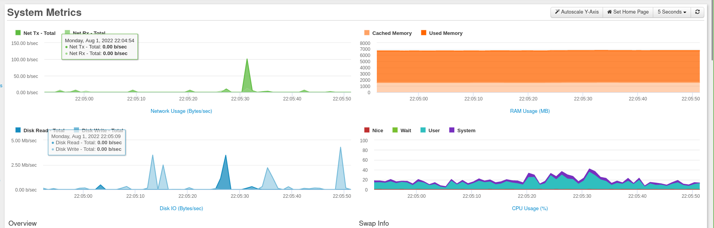

## Pricing
Finally, the pricing can make a big difference when choosing the Profiler.
In terms of a JProfiler, the Floating package(when profiler can be used by many developers) cost $2199, however if you want to get a support and upgrades , the package will cost you  $3078. After one year, each new upgrade will cost you $799. With FusionReactor you can choose from Enterprise or Ultimate packages. Here is the details on how these packages are differ from each other(remember you get a whole customer support in both packages)
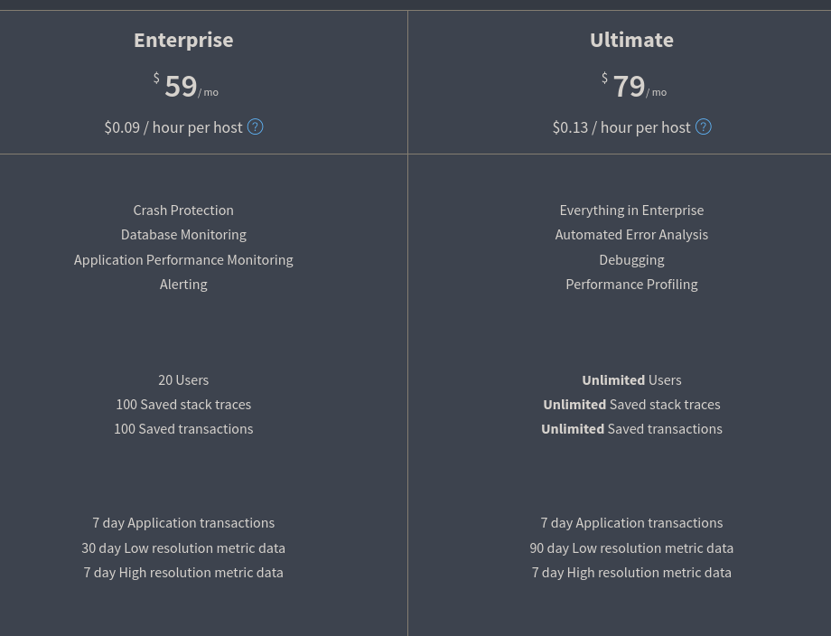
You can also decrease the bill by choosing an annual based payment. If you choose Enterprise package for a year it will cost you as little as $708 and you also don't have to pay additional fees for getting an updates versions of FusionReactor.


## Conclusion
Both tools described in this blog are amazing and dominant in Java World. Both of them five you a low cost production level profiling. However, with a broader range of features and cheaper price we highly recommend you to take a look at FusionReactor. If you are interested please book a demo with us.


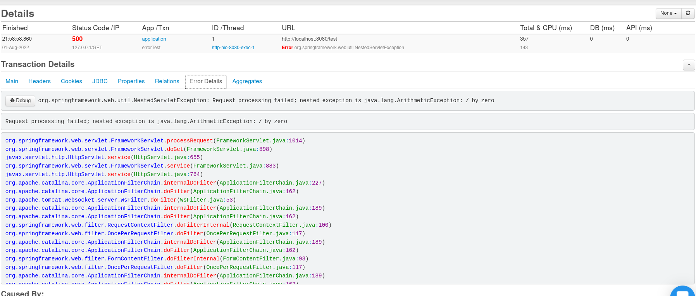
